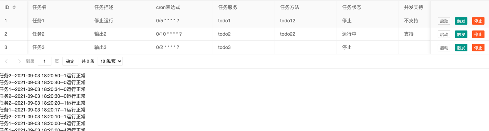
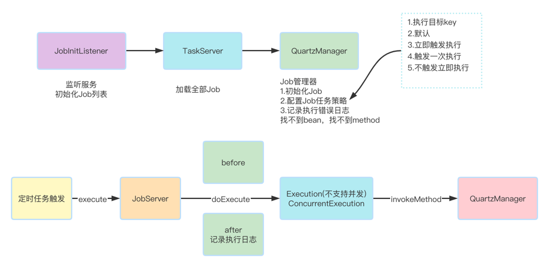
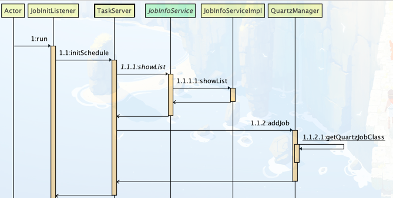

## Job管理平台
### 1.功能介绍
> 1.支持Job的动态修改（corn表达式、执行方法、执行bean）
> 
> 2.支持Job的动态启停和立即触发
### 2.使用技术
```
    1.MybatisPlus
    2.quartz
    3.thymeleaf
    4.webSocket
```
### 3.效果图


### 4.流程图


### 5.时序图

