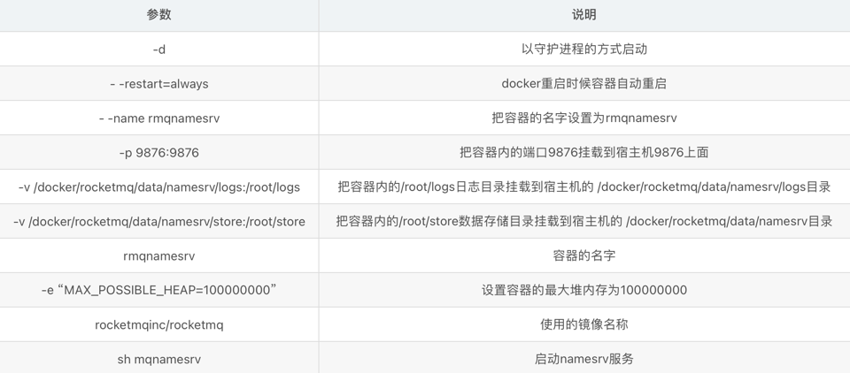
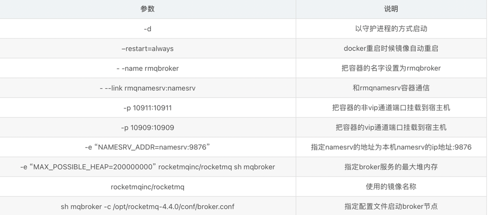
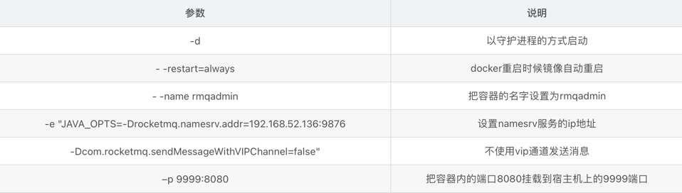

## 部署rocketmq
linux，docker部署
### 1.拉取MQ镜像
> docker pull rocketmqinc/rocketmq
### 2.创建配置文件
```
/docker/rocketmq/conf/broker.conf
# 所属集群名称，如果节点较多可以配置多个
brokerClusterName = DefaultCluster
#broker名称，master和slave使用相同的名称，表明他们的主从关系
brokerName = broker-a
#0表示Master，大于0表示不同的slave
brokerId = 0
#表示几点做消息删除动作，默认是凌晨4点
deleteWhen = 04
#在磁盘上保留消息的时长，单位是小时
fileReservedTime = 48
#有三个值：SYNC_MASTER，ASYNC_MASTER，SLAVE；同步和异步表示Master和Slave之间同步数据的机制；
brokerRole = ASYNC_MASTER
#刷盘策略，取值为：ASYNC_FLUSH，SYNC_FLUSH表示同步刷盘和异步刷盘；SYNC_FLUSH消息写入磁盘后才返回成功状态，ASYNC_FLUSH不需要；
flushDiskType = ASYNC_FLUSH
# 设置broker节点所在服务器的ip地址
brokerIP1 = 服务器IP
```
### 3.部署namesrv容器
创建文件夹
> mkdir -p /docker/rocketmq/data/namesrv/logs
/docker/rocketmq/data/namesrv/store
```
docker run -d \
--restart=always \
--name rmqnamesrv \
-p 9876:9876 \
-v /docker/rocketmq/data/namesrv/logs:/root/logs \
-v /docker/rocketmq/data/namesrv/store:/root/store \
-e "MAX_POSSIBLE_HEAP=100000000" \
rocketmqinc/rocketmq \
sh mqnamesrv 
```

### 4.部署broker容器
创建文件夹
> mkdir -p  /docker/rocketmq/data/broker/logs   
>           /docker/rocketmq/data/broker/store /docker/rocketmq/conf
```
docker run -d  \
--restart=always \
--name rmqbroker \
--link rmqnamesrv:namesrv \
-p 10911:10911 \
-p 10909:10909 \
-v  /docker/rocketmq/data/broker/logs:/root/logs \
-v  /docker/rocketmq/data/broker/store:/root/store \
-v /docker/rocketmq/conf/broker.conf:/opt/rocketmq-4.4.0/conf/broker.conf \
-e "NAMESRV_ADDR=namesrv:9876" \
-e "MAX_POSSIBLE_HEAP=200000000" \
rocketmqinc/rocketmq \
sh mqbroker -c /opt/rocketmq-4.4.0/conf/broker.conf 
```
参数	说明

### 5.部署rockermq-console服务
> docker pull pangliang/rocketmq-console-ng

```
docker run -d \
--restart=always \
--name rmqadmin \
-e "JAVA_OPTS=-Drocketmq.namesrv.addr=服务器IP:9876 \
-Dcom.rocketmq.sendMessageWithVIPChannel=false" \
-p 9999:8080 \
pangliang/rocketmq-console-ng
```


### 6.启动
注意开放9999 10911 10909端口

生产者组：一般只有一个生产者组，生产者定义topic
消费者组：一批topic和tag相同的消费者
